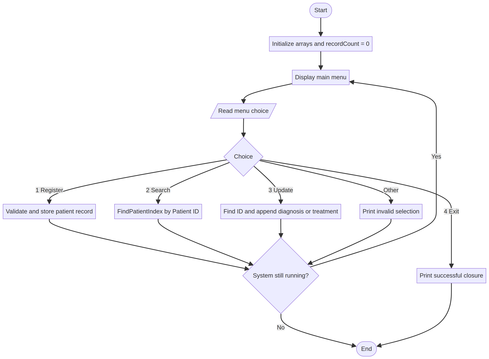

# Designing Logical Solutions for Sierra Leone Community Challenges

## Digital Healthcare Patient Data Management System (DHPDMS)

**Course Code:** PROG101  
**Course Title:** Principles of Programming Logic and Design  
**Student:** Alex Alimamy Debe Kamara (Abubakar Idrisu Bangura)  
**Student ID:** 905006307  
**Department:** Information and Communication Technology  
**Institution:** Limkokwing University of Creative Technology, Sierra Leone  
**Examiner:** Elijah Fullah  
**Submission:** Week 4, Semester 01 (2026/2027)  
**Date:** 7 October 2026

## Table of Contents

1. Problem Analysis and Background  
2. Proposed Solution and Computational Thinking  
3. Sustainable Development Goals  
4. Open Source and Digital Public Goods  
5. Community Impact and Sustainability  
6. System Architecture and Functional Modules  
7. Step-by-Step Algorithm  
8. Pseudocode Implementation  
9. Flowchart Structure  
10. Expected Outputs and Sample Scenarios  
11. GitHub Repository and Submission Guide  
12. References

# 1. Problem Analysis and Background

## 1.1 Problem description

Many community clinics and public hospitals in Sierra Leone have historically depended on paper files, notebooks, and physical folders to record patient information. Paper records can be damaged by moisture, humidity, fire, loss, or ordinary wear. Retrieval can also be slow when a patient needs care urgently or when the file is stored in another department.

Fragmented records create a second problem. A patient may visit several clinics and carry incomplete information from one facility to another. If a previous diagnosis, allergy, or treatment is unavailable, a health worker may need to repeat questions or tests. This can delay care and increase the risk of inconsistent decisions. Paper folders also provide limited access control and do not automatically create an audit trail.

This assignment proposes the **Digital Healthcare Patient Data Management System (DHPDMS)**, a small offline-first logic model that demonstrates registration, search, and medical-record updates. It is designed for programming-logic practice, not as a production clinical system.

## 1.2 Proposed solution

DHPDMS stores a bounded set of synthetic patient records in parallel arrays. Each record includes a patient ID, name, age, gender, contact number, and diagnosis history. A menu loop allows an authorized operator in this classroom model to register a patient, search for a patient, append a diagnosis or treatment, or exit.

The system uses a reusable sequential-search function. The function returns the matching array position or `-1` when no record exists. Registration validates required fields, prevents impossible ages, checks for duplicate patient IDs, and prevents storage beyond `MAX_PATIENTS`. Updating also requires an existing patient ID before it appends a new entry.

A real system would replace the arrays with a secure, backed-up database and would require authentication, role-based permissions, encryption, audit logging, consent and retention rules, interoperability standards, and clinical governance.

# 2. Proposed Solution and Computational Thinking

## 2.1 Decomposition

The workflow is divided into four main modules: `Main`, `RegisterPatient`, `SearchPatient`, and `UpdateRecord`. Two reusable functions support them: `FindPatientIndex` and `ValidatePatientInput`.

## 2.2 Pattern recognition

The same sequence appears during many clinic visits: identify the patient, retrieve the existing record, review relevant history, and append a new consultation event. The design also recognizes that every search can use the same loop and comparison rule.

## 2.3 Abstraction

The prototype omits database drivers, network protocols, hospital information-system integrations, and physical storage details. It focuses on variables, arrays, decisions, loops, functions, and outputs. The selected fields represent only a minimal classroom data model.

## 2.4 Algorithm design

The program uses sequence for menu processing, selection for menu choices and validation, repetition through a `WHILE` menu loop and `FOR` search loop, and modular procedures for each patient operation.

# 3. Sustainable Development Goals

## 3.1 SDG 3: Good Health and Well-being

DHPDMS aligns with SDG 3 by supporting faster retrieval and continuity of health information. A reliable record can help a health worker see previous information rather than starting from an incomplete history. This is a potential contribution to safer and more accessible care, not a guarantee of clinical outcomes.

## 3.2 SDG 9: Industry, Innovation and Infrastructure

The project aligns with SDG 9 by demonstrating how open, maintainable digital infrastructure can support a public-service workflow. An offline-first design is relevant to environments where connectivity may be intermittent. A production version should synchronize safely when connectivity returns and should preserve data integrity during outages.

# 4. Open Source and Digital Public Goods

## 4.1 Open-source justification

Open-source software can reduce licensing barriers, avoid vendor lock-in, and allow Sierra Leonean students and ICT professionals to inspect and adapt the logic. Publishing assumptions also makes errors easier to identify and correct. The repository contains plain-text pseudocode and flowchart source so that the design remains readable.

## 4.2 Digital Public Goods justification

The project has the potential to support a digital public good because it addresses a public health need through reusable, adaptable logic. However, openness alone is not enough. A responsible health implementation would need privacy-by-design, minimum necessary data collection, secure authentication, access levels, audit records, encryption, backup and recovery, accessibility, and a clear owner responsible for maintenance.

# 5. Community Impact and Sustainability

The direct beneficiaries are patients, nurses, medical officers, records officers, and administrative staff. Faster retrieval may reduce waiting and avoid unnecessary duplication. A unified record structure may also improve continuity when a patient moves between departments or facilities.

The system is intended to run on low-cost hardware and to support local maintenance. Sustainability would depend on staff training, user support, electricity, backup procedures, replacement hardware, and a realistic data-governance policy. The system should not assume that every patient has a phone or reliable internet access.

# 6. System Architecture and Functional Modules

| Module | Main responsibility |
|---|---|
| `Main` | Displays the menu, reads the choice, and repeats until exit |
| `RegisterPatient` | Validates and stores new synthetic patient data |
| `SearchPatient` | Finds and displays a patient record by ID |
| `UpdateRecord` | Appends a diagnosis or treatment to an existing record |
| `FindPatientIndex` | Sequentially searches IDs and returns an index or `-1` |
| `ValidatePatientInput` | Checks required fields and age range |

**Data model:** `patientID[]`, `fullName[]`, `age[]`, `gender[]`, `contactNumber[]`, and `diagnosisHistory[]`. The arrays use the same index for one patient record. `recordCount` identifies how many positions are currently occupied.

# 7. Step-by-Step Algorithm

1. Start the system.
2. Set `MAX_PATIENTS` and initialize empty arrays.
3. Set `recordCount = 0` and `isSystemRunning = TRUE`.
4. Display the menu inside a `WHILE` loop.
5. Read `menuChoice`.
6. If the choice is 1, call `RegisterPatient`.
7. If the choice is 2, call `SearchPatient`.
8. If the choice is 3, call `UpdateRecord`.
9. If the choice is 4, set `isSystemRunning = FALSE`.
10. For any other value, display an invalid-selection message.
11. When the loop ends, print a successful closure message.
12. End the program.

# 8. Pseudocode Implementation

The complete corrected pseudocode is provided in `Pseudocode/dhpdm_pseudocode.txt`. It improves the short Gemini draft by adding a record-count boundary, duplicate-ID detection, age validation, an actual reusable search function, a real update operation, and clear failure paths for missing records.

# 9. Flowchart Structure

*Figure 1. Main menu flow showing registration, searching, updating, invalid-choice handling, repetition, and exit.*

The editable Mermaid source is stored in `Flowcharts/dhpdm_system.mmd`.

# 10. Expected Outputs and Sample Scenarios

## Scenario A: Register a patient

**Input:** Choice `1`; ID `P102`; name `Alex Kamara`; age `25`; gender `Male`; contact `076000000`; diagnosis `Malaria test positive - treatment recorded`.

**Expected output:** `Patient record successfully saved for ID: P102`.

## Scenario B: Search a stored record

**Input:** Choice `2`; patient ID `P102`.

**Expected output:** The system prints the name, age, gender, contact number, and diagnosis history stored at the matching array position.

## Scenario C: Update a record

**Input:** Choice `3`; patient ID `P102`; new entry `Follow-up completed - medication continued`.

**Expected output:** `Medical record updated successfully.` The new entry is appended to the diagnosis history.

## Scenario D: Search for a missing record

**Input:** Choice `2`; patient ID `P999`.

**Expected output:** `Patient record not found.` No array entry is changed.

## Scenario E: Invalid registration

**Input:** Blank ID, blank name, or age `-2`.

**Expected output:** `Invalid patient information. Record not saved.`

## Scenario F: Exit

**Input:** Choice `4`.

**Expected output:** `System closed successfully.`

# 11. GitHub Repository and Submission Guide

The repository includes `README.md`, the report in `Documentation/`, the flowchart source and PNG in `Flowcharts/`, the pseudocode in `Pseudocode/`, references, and a screenshot-evidence guide. The planned progressive commits are:

1. `Initial commit: Add README and project outline`
2. `Docs: Add rationale and SDG alignment`
3. `Logic: Add DHPDMS pseudocode`
4. `Docs: Add flowchart and complete report`

For printed evidence, capture the repository home page, the commits page, and the rendered flowchart. Screenshots must not contain real patient information.

# 12. References

1. Ministry of Health, Sierra Leone. (n.d.). *EMR system to improve health care delivery in Sierra Leone*. https://mohs.gov.sl/emr-system-to-improve-health-care-delivery-in-sierra-leone/
2. World Health Organization. (n.d.). *MOH eHealth strategy 2018–2023: Sierra Leone*. https://extranet.who.int/countryplanningcycles/planning-cycle-files/moh-ehealth-strategy-2018-2023-0
3. Chukwu, E., et al. (2022). *Digital Health Solutions and State of Interoperability*. https://pmc.ncbi.nlm.nih.gov/articles/PMC9233249/
4. United Nations Department of Economic and Social Affairs. (n.d.). *Goal 3: Good health and well-being*. https://sdgs.un.org/goals/goal3
5. United Nations Department of Economic and Social Affairs. (n.d.). *Goal 9: Industry, innovation and infrastructure*. https://sdgs.un.org/goals/goal9
6. Digital Public Goods Alliance. (n.d.). *Digital Public Goods Standard*. https://digitalpublicgoods.net/standard/

**Academic note:** All examples are synthetic. This project must not be connected to real patient data without formal authorization, security controls, clinical validation, and applicable legal and ethical review.
